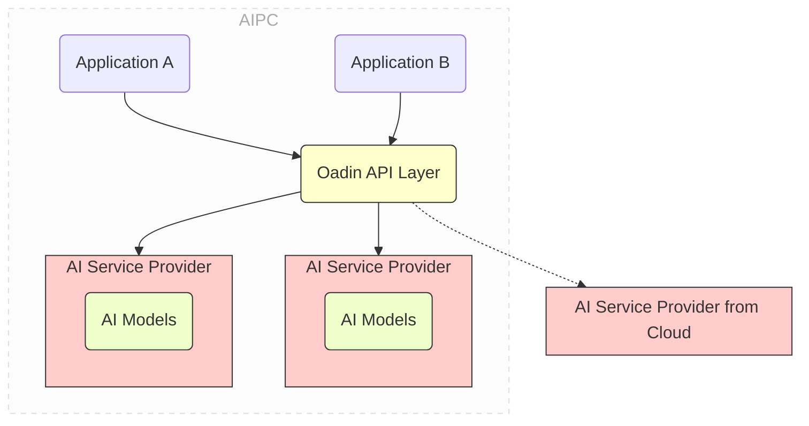

# Oadin (Open AIPC Development INfras- 🔧 **Sample Code** - Multi-language examples for C#, JavaScript, etc.
- 🌟 **Application Templates** - Complete application examples like FreeChat

### 📋 Supported Service Types

**Core AI Services:**

| Service Name | Endpoint | Description |
|-------------|----------|-------------|
| 💬 Chat | `/oadin/v0.2/services/chat` | Multi-turn conversations, supports streaming output, deep thinking, tool calling |
| 🔍 Text Embedding | `/oadin/v0.2/services/embed` | Text vectorization, supports multiple embedding models for semantic retrieval |
| ✍️ Text Generation | `/oadin/v0.2/services/generate` | Single-turn text generation, supports multiple generation models and parameter adjustment |
| 🎨 Text-to-Image | `/oadin/v0.2/services/text-to-image` | Generate images from text descriptions, supports multiple text-to-image models |

**Advanced Services:**

| Service Name | Endpoint | Description |
|-------------|----------|-------------|
| 🛠️ MCP Tools | `/oadin/v0.2/mcp` | Model Context Protocol tool integration and management |
| 📚 RAG Documents | `/oadin/v0.2/playground` | Intelligent document processing, knowledge base construction, retrieval optimization |

### 🏗️ Supported AI Engines

**Local Engines:**
- 🦙 **Ollama** - Lightweight local large model runtime engine, main integration engine for the project
- ⚡ **IPEX-LLM** - Intel optimized high-performance inference engine (experimental support)
- 🔧 **OpenVINO** - Intel edge AI optimization toolkit (experimental support)

**Cloud Services:**
- 🌟 **OpenAI** - GPT series models (via API compatibility)
- 🧠 **DeepSeek** - DeepSeek-V3, DeepSeek-R1 series
- 🌐 **Baidu Wenxin** - Wenxin Yiyan, ERNIE series
- 🦄 **Alibaba Tongyi** - Tongyi Qianwen, Tongyi Wanxiang text-to-image
- 💫 **Tencent Hunyuan** - Hunyuan chat, Hunyuan text-to-image
- 📊 **SmartVision** - Digital China Wenxue platform

## Features of Oadinture)

[中文](README.md) | English

Current version is Oadin v0.2.0, providing production-grade AI service infrastructure. Welcome to submit Issues and feature suggestions for any problems discovered.

Oadin now supports a complete AI service ecosystem, including core functions such as dialogue, embedding, generation, text-to-image, MCP tool integration, providing a unified and efficient service platform for AI PC application development.

### 🎯 v0.2.0 Current Features

**🚀 Core Architecture Features:**
- 🏗️ **Unified Service Layer** - Unified AI service interface supporting multiple service providers
- 🔧 **Intelligent Scheduling Engine** - Automatically selects the most suitable service provider
- 📊 **Web Management Console** - Complete visual management interface
- 🛡️ **Service Provider Management** - Flexible local and remote service provider configuration

**🆕 Core Functions:**
- 💬 **Chat Service** - Supports multi-turn conversations, streaming output, deep thinking mode
- 🔍 **Text Embedding Service** - Supports multiple embedding models for vectorization and retrieval
- ✍️ **Text Generation Service** - Single-turn text generation, supports multiple generation models
- 🎨 **Text-to-Image Service** - Generate images from text descriptions

**🔌 Ecosystem:**
- 🤖 **Local Engines** - Mainly supports Ollama, experimental support for IPEX-LLM, OpenVINO
- 🌐 **Cloud Service Integration** - Baidu Wenxin, Alibaba Tongyi, Tencent Hunyuan, DeepSeek, SmartVision
- �️ **MCP Tool Ecosystem** - Model Context Protocol tool integration and management
- 📚 **Playground** - Interactive testing environment, supports RAG document processing

**💼 Practical Features:**
- � **Security Authentication** - Basic API key authentication
- � **Service Monitoring** - Basic service status monitoring and health checks
- 🔄 **Hybrid Scheduling** - Intelligent switching between local and cloud services
- � **Easy Deployment** - Simple installation and configuration process

**🎯 Developer Support:**
- � **API Documentation** - Complete REST API documentation and examples
- 🧪 **Testing Tools** - Playground interactive testing environment
- � **Sample Code** - Multi-language examples for C#, JavaScript, etc.
- 🌟 **Application Templates** - Complete application examples like FreeChat

## Features of Oadin

Oadin (AIPC Open Gateway) aims to decouple AI applications on AI PCs from the AI services they rely
on. It is designed to provide developers with an extremely simple and easy-to-use infrastructure to
install local AI services in their development environments and publish their AI applications
without packaging their own AI stacks and models.



By providing unified platform-level AI services through Oadin, AI applications no longer need to
package and publish AI engines and models with their own programs. Meanwhile, multiple AI
applications on an AI PC use unified AI services provided by Oadin, thus eliminating the need to
redundantly deploy and start their own AI stacks. This significantly reduces application size,
eliminates redundant downloads of the same AI stacks and models by each application, and avoids
competition for memory consumption during execution.

Oadin provides the following basic features:

- One-stop AI service installation

  - During development, developers can install local AI services in their development environments
    through simple commands such as `oadin install chat` or
    `oadin pull-model deepseek-r1:1.5b for chat`. Oadin will automatically download and install the most
    suitable and optimized AI stack (e.g., `ollama`) and models.
  - During deployment, developers can publish their AI applications without packaging dependent AI
    stacks and models. Oadin will automatically pull the required AI stacks and models for the
    deployed PC when needed.

- Decoupling applications and AI service providers through shared services and standard APIs

  - The Oadin API layer provides standardized APIs for typical AI services such as chat and embedding.
    Developers focus on the business logic of their applications without paying too much attention
    to the underlying AI service stack.
  - AI services are provided by the platform and shared by multiple applications on the same system.
    This avoids redundant downloads of the same AI service stacks and models by each application,
    reducing competition for memory consumption.

- Automatic API conversion to adapt to popular API styles
  - In addition, the Oadin API layer also provides automatic API conversion between popular API styles
    (e.g., OpenAI API) and AI services provided by Oadin. This allows developers to easily migrate
    existing cloud-based AI applications to Oadin-based AIPC applications.
- Hybrid scheduling between local and cloud AI service providers
  - Oadin allows developers to install AI services in local development environments. These services
    can be accessed through the Oadin API layer.

## Building the Oadin Command-Line Tool

As a developer, to build Oadin, you need to install [golang](https://go.dev/) on your system.

If your development environment is Windows, you may need to install [MSYS2](https://www.msys2.org)
to get commands like Make.

Next, download or clone this project to a directory such as `/path_to_oadin`.

Then run the following commands:

```bash
cd /path_to_oadin

make build-all
```

This will generate an executable file named oadin, which is the Oadin command line.

## Using the Oadin Command-Line Tool

You can view the help information of the command-line tool by entering `oadin -h`.

Use commands to start and stop the Oadin service

```bash
# Start Oadin in the foreground
oadin server start

# Start Oadin in the background
oadin server start -d

# Stop Oadin
oadin server stop
```

Oadin has two key concepts: **Service** and **Service Provider**:

- A **service** is a set of AI functions, such as chat and embedding, that provide RESTful
  interfaces for applications to call.
- A **service provider** is the specific entity that implements and provides the service. Service
  providers can be local or remote.

A service can have multiple service providers. For example, a chat service can have both local and
remote chat service providers. The local service provider is provided by ollama, and the remote
service provider is provided by remote DeepSeek or Tongyi Qianwen. When an application calls the
chat service using the Oadin RESTful API, Oadin will automatically select the appropriate service
provider according to certain rules to complete the actual call of the service.

As a developer, you can quickly install, import, and configure the corresponding Oadin services and
service providers through the following commands:

```sh
# Install AI services locally
# Oadin will install the necessary AI stack (such as ollama) and Oadin-recommended models
oadin install chat
oadin install embed

# In addition to the default models, you can install more models in the service
# The current version only supports pulling models based on ollama
# Version v0.3 will support more AI stacks and models, as well as other services
oadin pull <model_name> -for <service_name> --provider <provider_name>

# Get service information, you can view the specified service, if not specified, output all service information
oadin get services <service_name>

# Modify service configuration
# hybrid_policy   specifies the scheduling policy of the specific service, 
# 			      the optional values are always_local, always_remote, default
# remote_provider specifies the remote service provider
# local_provider  specifies the local service provider
oadin edit service <service_name> --hybrid_policy always_remote --remote_provider xxx --local_provider xxx

# Get service provider information, you can set optional parameters to get the specified service provider information
oadin get service_providers --service <service_name> --provider <provider_name> --remote <local/remote>

# Get model information, you can set optional parameters to get the specified model information
oadin get models --provider <provider_name>

# Install service provider, the model will be automatically pulled during the installation process
oadin install service_provider -f xx/xxx.json
# The file name is not required, the content must be in JSON format, example:
{
  "provider_name": "local_ollama_chat"
  "service_name": "chat",
  "service_source": "local",
  "desc": "Local ollama chat/completion",
  "api_flavor": "ollama",
  "method": "POST",
  "url": "http://localhost:11434/api/chat",
  "auth_type": "none",
  "auth_key": "",
  "models": [
    "qwen2.5:0.5b",
    "qwen2:0.5b"
  ]
}

# Modify service provider configuration, here you can only modify the service provider configuration information, 
# model changes need to be done by pulling models and deleting models
oadin edit service_provider <provider_name> -f xxx/xxx.json
# Example:
{
  "provider_name": "local_ollama_chat"
  "service_name": "chat",
  "service_source": "local",
  "desc": "Local ollama chat/completion",
  "api_flavor": "ollama",
  "method": "POST",
  "url": "http://localhost:11434/api/chat",
  "auth_type": "none",
  "auth_key": ""
}

# Delete service provider
oadin delete service_provider <provider_name>

# Delete model Required parameter: --provider
oadin delete model <model_name>  --provider <provider_name>
```

## Calling the Oadin API

The Oadin API is a Restful API. You can call this API in a way similar to calling cloud AI services
(such as OpenAI). For detailed API specifications, please refer to the Oadin API specifications.

It is worth noting that the current Oadin preview provides basic chat and other services, and the next
version will provide more services related to text-to-image and voice.

### 📚 API Endpoints Overview

| Service Type | Endpoint | Description |
|-------------|----------|-------------|
| 💬 Chat | `POST /oadin/v0.2/services/chat` | Multi-turn conversations with streaming support<br/>Supports `think` field for deep thinking control |
| 🔍 Embed | `POST /oadin/v0.2/services/embed` | Text vectorization |
| ✍️ Generate | `POST /oadin/v0.2/services/generate` | Single-turn text generation |
| 🎨 Text-to-Image | `POST /oadin/v0.2/services/text-to-image` | Generate images from text |

### 🌐 Web Console

Access http://localhost:16688 for the complete Web management interface:
- 📊 **Dashboard** - Service status and performance monitoring
- 🎮 **Playground** - Interactive testing environment
- 📁 **Document Management** - RAG document upload and processing
- 🔧 **MCP Management** - Tool service configuration

### 💻 API Usage Examples

**Chat Service:**

Basic conversation example:
```sh
curl -X POST http://localhost:16688/oadin/v0.2/services/chat \
  -H "Content-Type: application/json" \
  -d '{
    "model": "deepseek-r1:7b",
    "messages": [{"role": "user", "content": "Why is the sky blue?"}],
    "stream": false
  }'
```

**Deep Thinking Feature:**
For models that support deep thinking (e.g., DeepSeek-R1 series), you can control the thinking process using the `think` field:

```sh
# Enable deep thinking (show thinking process)
curl -X POST http://localhost:16688/oadin/v0.2/services/chat \
  -H "Content-Type: application/json" \
  -d '{
    "model": "deepseek-r1:7b",
    "messages": [{"role": "user", "content": "Explain the basic principles of quantum mechanics"}],
    "think": true,
    "stream": false
  }'

# Disable deep thinking (direct answer)
curl -X POST http://localhost:16688/oadin/v0.2/services/chat \
  -H "Content-Type: application/json" \
  -d '{
    "model": "deepseek-r1:7b",
    "messages": [{"role": "user", "content": "How is the weather today?"}],
    "think": false,
    "stream": false
  }'
```

> **Note**: The `think` field is only effective for models that support deep thinking, such as the DeepSeek-R1 series. Other models will ignore this parameter.

**Other API Examples:**
```sh
# Embed Service
curl -X POST http://localhost:16688/oadin/v0.2/services/embed \
  -H "Content-Type: application/json" \
  -d '{"model":"nomic-embed-text","input":["text1","text2"]}'

# Text-to-Image Service  
curl -X POST http://localhost:16688/oadin/v0.2/services/text-to-image \
  -H "Content-Type: application/json" \
  -d '{"model":"wanx2.1-t2i-turbo","prompt":"a cute cat"}'

# Generate Service
curl -X POST http://localhost:16688/oadin/v0.2/services/generate \
  -H "Content-Type: application/json" \
  -d '{"model":"deepseek-r1:7b","prompt":"Write a Python program","stream":false}'
```

Furthermore, if you are already using applications with OpenAI API or ollama API, etc., you do not
need to rewrite the way you call Oadin to comply with its specifications.

Because Oadin can automatically convert these popular API styles, you can easily migrate your
application by simply changing the endpoint URL.

For example, if you are using OpenAI's chat completion service, you only need to replace the
endpoint URL from `https://api.openai.com/v1/chat/completions` to
`http://localhost:16688/oadin/v0.2/api_flavors/openai/v1/chat/completions`.

NOTE Please note that the new URL for calling Oadin is located at `api_flavors/openai`, and the rest
of the URL is the same as the original OpenAI API, i.e., `/v1/chat/completions`.

If you are using the ollama API, you can replace the endpoint URL from
`https://localhost:11434/api/chat` to `http://localhost:16688/oadin/v0.2/api_flavors/ollama/api/chat`.
Similarly, it is located at `api_flavors/ollama`, and the rest of the URL is the same as the
original ollama API, i.e., `/api/chat`.

## 🎯 Application Integration and Deployment

### 📦 Oadin Checker v0.2.0

Oadin provides a lightweight application integration solution that allows your AI applications to work without packaging AI models and service stacks.

**Supported Development Languages:**
- 🟨 **JavaScript/Node.js** - `npm install oadin-lib-1.2.66.tgz`
- 🔷 **C#/.NET** - `OadinClient` NuGet package
- 🔧 **C/C++** - `OadinChecker.dll` and header files

### 🛠️ Integration Steps

**1. Create `.oadin` configuration file (v0.2.0 format):**
```json
{
  "version": "v0.2",
  "services": {
    "chat": {
      "service_providers": {
        "local": "local_ollama_chat",
        "remote": "deepseek_chat"
      },
      "hybrid_policy": "default"
    },
    "embed": {
      "service_providers": {
        "local": "local_ollama_embed",
        "remote": ""
      },
      "hybrid_policy": "always_local"
    }
  },
  "service_providers": {
    "local_ollama_chat": {
      "service_name": "chat",
      "service_source": "local",
      "desc": "Local Ollama chat service",
      "api_flavor": "ollama",
      "method": "POST",
      "url": "http://localhost:11434/api/chat",
      "auth_type": "none",
      "auth_key": "",
      "models": ["qwen3:8b", "deepseek-r1:8b"]
    },
    "deepseek_chat": {
      "service_name": "chat",
      "service_source": "remote",
      "desc": "DeepSeek remote chat service",
      "api_flavor": "openai",
      "method": "POST",
      "url": "https://api.deepseek.com/v1/chat/completions",
      "auth_type": "apikey",
      "auth_key": "your_deepseek_api_key",
      "models": ["deepseek-chat", "deepseek-coder"]
    },
    "local_ollama_embed": {
      "service_name": "embed",
      "service_source": "local",
      "desc": "Local Ollama embedding service",
      "api_flavor": "ollama",
      "method": "POST",
      "url": "http://localhost:11434/api/embeddings",
      "auth_type": "none",
      "auth_key": "",
      "models": ["nomic-embed-text"]
    }
  }
}
```

**2. Code Integration Examples:**

**Node.js Integration:**
```javascript
const OadinLib = require('oadin-lib');

async function main() {
    const oadin = new OadinLib();
    
    // Initialize Oadin (includes download, startup, config import)
    const success = await oadin.OadinInit('./.oadin');
    if (!success) {
        console.error('Oadin initialization failed');
        return;
    }
    
    // Use chat service
    const chatData = {
        model: 'deepseek-r1:8b',
        messages: [{ role: 'user', content: 'Hello' }],
        stream: false
    };
    
    const response = await oadin.Chat(chatData);
    console.log('AI Reply:', response);
}

main().catch(console.error);
```

**C# Integration:**
```csharp
using Oadin;

class Program
{
    static async Task Main(string[] args)
    {
        var checker = new OadinChecker();
        
        // Initialize Oadin (auto check, download, start, import config)
        await OadinChecker.OadinInit(this);
        
        // Use HTTP client to call Oadin API
        using var client = new HttpClient();
        var chatData = new
        {
            model = "deepseek-r1:8b",
            messages = new[] { 
                new { role = "user", content = "Hello" }
            },
            stream = false
        };
        
        var json = JsonSerializer.Serialize(chatData);
        var content = new StringContent(json, Encoding.UTF8, "application/json");
        var response = await client.PostAsync("http://localhost:16688/oadin/v0.2/services/chat", content);
        var result = await response.Content.ReadAsStringAsync();
        Console.WriteLine($"AI Reply: {result}");
    }
}
```

**C/C++ Integration:**
```c
#include "OadinChecker.h"
#include <stdio.h>

int main() {
    // Initialize Oadin (auto check, download, configure)
    // Note: Place the .oadin configuration file in the project root directory
    int result = OadinInit();
    if (result != 0) {
        printf("Oadin initialization failed: %d\n", result);
        return 1;
    }
    
    printf("Oadin is ready, can call AI services\n");
    
    // Use HTTP client to call Oadin API
    // POST http://localhost:16688/oadin/v0.2/services/chat
    // Service providers defined in config file will be automatically imported and configured
    
    return 0;
}
```

> **Note**: Based on the actual code implementation, the `.oadin` configuration file uses a service provider format that includes complete service definitions and provider information. The file should be placed in the project root directory, and the SDK will automatically read it and import the configuration via the `oadin import` command.

## Publishing Your Oadin-Based AI Application

To publish your AI application, you only need to package the application with a tiny Oadin component,
the so-called `Oadin Checker`, which is `OadinChecker.dll` on Windows. You do not need to publish the AI
stack or models.

Taking a C/C++/C# application as an example, the following are the steps to deploy an Oadin-based AI
application.

1. Prepare the `.oadin` file along with your application. The `.oadin` file is a service provider configuration file that
   specifies the AI services and service providers required by the application. For example, the `.oadin` file
   might look like this:

```json
{
  "version": "v0.2",
  "services": {
    "chat": {
      "service_providers": {
        "local": "local_ollama_chat",
        "remote": "deepseek_chat"
      },
      "hybrid_policy": "default"
    },
    "embed": {
      "service_providers": {
        "local": "local_ollama_embed",
        "remote": ""
      },
      "hybrid_policy": "always_local"
    }
  },
  "service_providers": {
    "local_ollama_chat": {
      "service_name": "chat",
      "service_source": "local",
      "desc": "Local Ollama chat service",
      "api_flavor": "ollama",
      "method": "POST",
      "url": "http://localhost:11434/api/chat",
      "auth_type": "none",
      "auth_key": "",
      "models": ["qwen3:8b", "deepseek-r1:8b"]
    },
    "deepseek_chat": {
      "service_name": "chat",
      "service_source": "remote",
      "desc": "DeepSeek remote chat service",
      "api_flavor": "openai",
      "method": "POST",
      "url": "https://api.deepseek.com/v1/chat/completions",
      "auth_type": "apikey",
      "auth_key": "your_deepseek_api_key",
      "models": ["deepseek-chat", "deepseek-coder"]
    },
    "local_ollama_embed": {
      "service_name": "embed",
      "service_source": "local",
      "desc": "Local Ollama embedding service",
      "api_flavor": "ollama",
      "method": "POST",
      "url": "http://localhost:11434/api/embeddings",
      "auth_type": "none",
      "auth_key": "",
      "models": ["nomic-embed-text"]
    }
  }
}
```

2. Include `OadinChecker.h` and call `OadinInit()` in your `main()` function. `OadinInit()` will:
   - Check if Oadin is installed on the target PC. If not, it will automatically download and install
     Oadin.
   - Import the service provider configuration from the `.oadin` file in the project root directory.
   - Set up the required AI services and service providers as defined in the configuration file.
3. Link the application with `OadinChecker.dll`.
4. Publish the application along with the `.oadin` file and the `OadinChecker.dll` file in the same
   directory as your application's `.exe` file.

> **Note**: Based on the actual code implementation, the `.oadin` configuration file uses a service provider format that includes complete service definitions and provider information. The file should be placed in the project root directory, and the SDK will automatically read it and import the configuration via the `oadin import` command.

## Quick Start

### 🔧 Install Oadin

**Build Method (Recommended):**
```bash
# Clone the project
git clone https://github.com/DigitalChinaOpenSource/oadin.git
cd oadin

# Build
make build-all
```

### ⚡ Quick Launch

```bash
# Start Oadin service
oadin server start

# Start in background
oadin server start -d

# Check service status by visiting http://localhost:16688

# Install basic AI services
oadin install chat
oadin install embed

# Pull recommended models
oadin pull deepseek-r1:7b -for chat
oadin pull nomic-embed-text -for embed
```

### 🎯 First Experience

1. **Access Web Console**: http://localhost:16688
2. **Open Playground**: Start chatting with AI
3. **Upload Documents**: Experience RAG document Q&A

## 📚 SDKs and Examples

**Official SDKs:**
- 🟨 **JavaScript/Node.js** - `oadin-lib` package
- 🔷 **C# SDK** - `OadinClient` class
- 🔧 **C/C++** - `OadinChecker.dll` and header files

**Sample Applications:**
- 💬 **FreeChat** - Complete AI chat application (C# .NET MAUI)
- Located in `example/FreeChat/` directory

## 🤝 Community and Support

### 📞 Get Help

- 📖 **Project Documentation**: README.md and docs/ directory
- 🐛 **Issue Reporting**: GitHub Issues

### 🤝 Contribution Guidelines

We welcome community contributions! Please check the contribution guidelines in the project to learn about:
- 🔀 Code contribution process
- 📋 Issue reporting templates
- 🧪 Testing requirements
- 📝 Documentation standards

---

## 📄 License

This project is licensed under the [Apache 2.0 License](LICENSE).

## 🙏 Acknowledgments

Thanks to all the developers and community members who have contributed to the Oadin project!

---

<div align="center">

**Make AI Accessible, Make Innovation Everywhere**

⭐ If this project helps you, please give us a Star!

</div>
