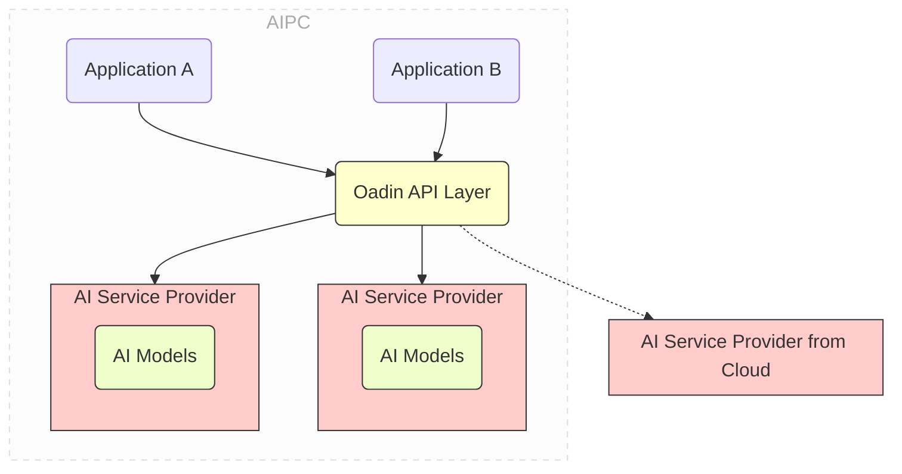

# Oadin (Open AIPC Development INfrastructure)

[English](README.md) | 中文

当前为 Oadin v0.2.0，提供生产级 AI 服务基础设施。欢迎就发现的问题提交 Issues 和功能建议。

Oadin 现已支持完整的 AI 服务生态，包括对话、嵌入、生成、文生图、MCP 工具集成等核心功能，为 AI PC 应用开发提供统一、高效的服务平台。

### 🎯 v0.2.0 当前功能

**🚀 核心架构特性：**

- 🏗️ **统一服务层** - 统一的 AI 服务接口，支持多种服务提供商
- 🔧 **智能调度引擎** - 自动选择最适合的服务提供商
- 📊 **Web 管理控制台** - 完整的可视化管理界面
- 🛡️ **服务商管理** - 灵活的本地和远程服务商配置

**🆕 核心功能：**

- 💬 **聊天对话服务** - 支持多轮对话、流式输出、深度思考模式
- 🔍 **文本嵌入服务** - 支持多种嵌入模型，用于向量化和检索
- ✍️ **文本生成服务** - 单轮文本生成，支持多种生成模型
- 🎨 **文生图服务** - 根据文本描述生成图像

**🔌 生态系统：**

- 🤖 **本地引擎** - 主要支持 Ollama，实验性支持 IPEX-LLM、OpenVINO
- 🌐 **云服务集成** - 百度文心、阿里通义、腾讯混元、DeepSeek、SmartVision
- 🛠️ **MCP 工具生态** - Model Context Protocol 工具集成和管理
- 📚 **Playground** - 交互式测试环境，支持 RAG 文档处理

**💼 实用特性：**

- 🔒 **安全认证** - 基础的 API 密钥认证
- 📈 **服务监控** - 基本的服务状态监控和健康检查
- 🔄 **混合调度** - 本地和云端服务的智能切换
- 🚀 **简便部署** - 简单的安装和配置流程

**🎯 开发者支持：**

- 📖 **API 文档** - 完整的 REST API 文档和示例
- 🧪 **测试工具** - Playground 交互式测试环境
- 🔧 **示例代码** - C#、JavaScript、Python 等多语言示例
- 🌟 **应用模板** - FreeChat 等完整应用示例

### 📋 支持的服务类型

**核心 AI 服务：**

| 服务名称    | 端点                                 | 描述                                       |
| ----------- | ------------------------------------ | ------------------------------------------ |
| 💬 聊天对话 | `/oadin/v0.2/services/chat`          | 多轮对话，支持流式输出、深度思考、工具调用 |
| 🔍 文本嵌入 | `/oadin/v0.2/services/embed`         | 文本向量化，支持多种嵌入模型，用于语义检索 |
| ✍️ 文本生成 | `/oadin/v0.2/services/generate`      | 单轮文本生成，支持多种生成模型和参数调节   |
| 🎨 文生图   | `/oadin/v0.2/services/text-to-image` | 根据文本描述生成图像，支持多种文生图模型   |

**高级服务：**

| 服务名称    | 端点                     | 描述                                  |
| ----------- | ------------------------ | ------------------------------------- |
| 🛠️ MCP 工具 | `/oadin/v0.2/mcp`        | Model Context Protocol 工具集成与管理 |
| 📚 RAG 文档 | `/oadin/v0.2/playground` | 智能文档处理、知识库构建、检索优化    |

### 🏗️ 支持的 AI 引擎

**本地引擎：**

- 🦙 **Ollama** - 轻量级本地大模型运行引擎，项目主要集成引擎
- ⚡ **IPEX-LLM** - Intel 优化的高性能推理引擎（实验性支持）
- 🔧 **OpenVINO** - Intel 边缘 AI 优化工具包（实验性支持）

**云端服务：**

- 🌟 **OpenAI** - GPT 系列模型（通过 API 兼容）
- 🧠 **DeepSeek** - DeepSeek-V3、DeepSeek-R1 系列
- 🌐 **百度千帆** - ERNIE 系列
- 🦄 **阿里通义** - 通义千问、通义万相文生图
- 💫 **腾讯混元** - 混元对话、混元文生图
- 📊 **SmartVision** - 神州数码问学平台

## Oadin 的功能

Oadin 的目标是解耦 AI PC 上的 AI 应用与它所依赖的 AI 服务。它旨在为开发者提供一个
极其简单易用的基础设施，以便他们在开发环境中安装本地 AI 服务，并发布他们的 AI 应用程序，无需打包自己
的 AI 堆栈和模型。



通过 Oadin 提供统一的平台级的 AI 服务，AI 应用不再需要随自己的程序一起打包和发布 AI 引擎及模型。同时
，AI PC 上的多个 AI 应用使用统一的 Oadin 提供的 AI 服务，因而无需冗余地部署和启动自己的 AI 栈。这显著
减少了应用大小，消除了每个应用重复下载相同 AI 栈和模型的情况，并在执行过程中避免了内存消耗的竞争。

Oadin 提供以下基本功能：

- 一站式 AI 服务安装

  - 在开发过程中，开发者可以通过简单的命令如 `oadin install chat` 或
    `oadin pull-model deepseek-r1:1.5b for chat` ， 在他们的开发环境中本地安装 AI 服务。Oadin 会自动下载
    并安 装最合适和优化的 AI 堆栈（例如 `ollama`）和模型

  - 在部署过程中，开发者可以无需打包依赖的 AI 栈和模型即可发布他们的 AI 应用程序。Oadin 将在需要时自动
    为部署的 PC 拉取所需的 AI 栈和模型。

- 解耦应用程序和 AI 服务提供商，通过共享服务和标准 API

  - Oadin API 层提供了标准化 API，用于典型 AI 服务如聊天、嵌入等。开发者专注于其应用程序的业务逻辑，无
    需过 多关注底层 AI 服务栈。

  - AI 服务按平台提供，由同一系统上的多个应用程序共享。这避免了每个应用程序重复下载相同的 AI 服务栈
    和模 型，减少了内存消耗的竞争。

- 自动 API 转换，适配流行的 API 风格

  - 此外，Oadin API 层还提供在流行的 API 风格（例如 OpenAI API）与 Oadin 提供的 AI 服务之间的自动 API 转
    换。 这样一来，开发者可以轻松地将现有的基于云 AI 的应用程序迁移到基于 Oadin 的 AIPC 应用程序。

- 本地与云 AI 服务提供商之间的混合调度

  - Oadin 允许开发者在本地开发环境中安装 AI 服务。这些服务可以通过 Oadin API 层进行访问。

- Web 控制台

  - Oadin 提供了一个配套的 Web 控制台，方便用户通过图形化界面与 Oadin 服务进行交互。
  - Web 控制台基于 React 构建，提供了包括服务状态监控、Playground 测试、RAG 文档管理等功能。
  - 开发者可以通过以下命令独立启动和开发 Web 控制台：

    ```sh
    cd frontend
    pnpm install
    pnpm run dev
    ```
## 从官网下载 Oadin（推荐）

从官网下载安装包并按照引导安装：
https://oadin.dcclouds.com/

## 构建 Oadin 命令行工具（开发者可选）

作为开发者，为了构建 Oadin，您需要在您的系统上安装 [golang](https://go.dev/)。

如果您的开发环境是 Windows，您可能需要安装 [MSYS2](https://www.msys2.org) ，以获得 Make 等命令。

接着，将此项目下载或克隆到如 `/path_to_oadin` 的目录中。

然后运行以下命令：

```sh
cd /path_to_oadin

make build-all
```

这将生成一个名为 oadin 的可执行文件，它是 Oadin 的命令行。

## 使用 Oadin 命令行工具

您可以通过输入 `oadin -h` 来查看命令行工具的帮助信息。

使用命令启动和停止 Oadin 服务

```sh
# 前台启动Oadin
oadin server start

# 后台启动Oadin
oadin server start -d

# 停止Oadin
oadin server stop
```

Oadin 有两个关键概念：**服务(Service)** 和 **服务提供商(Service Provider)**：

- 服务是一组 AI 功能，例如聊天 (chat)、嵌入(embed) 等，提供 RESTful 接口供应用程序调用使用。
- 服务提供商是实现并提供服务的具体实体。服务提供商可以是本地或远程的。

一个服务可以有多个服务提供商。例如，聊天服务可以同时有本地聊天服务提供商和远程聊天服务提供商。 其中
本地服务提供商由 ollama 提供，远程服务提供商由远程的 DeepSeek 或者通义千问提供。当应用程序使用 Oadin
的 RESTful API 调用聊天服务的时候，Oadin 会根据一定的规则， 自动选择合适的服务提供商，来完成该服务的真
正调用。

作为开发者，可以通过如下命令来快速安装、导入和配置相应的 Oadin 服务和服务提供商

```sh
# 将 AI 服务安装到本地
# Oadin 将安装必要的 AI 堆栈（如 ollama）和 Oadin 推荐的模型
oadin install chat
oadin install embed

# 除了默认的模型之外，您可以在服务中安装更多的模型
# 当前版本暂仅支持基于 ollama 拉取模型
# v0.3 版本将支持更多的 AI 堆栈和模型，以及其他服务
oadin pull <model_name> -for <service_name> --provider <provider_name>

# 获取服务信息，可查看指定服务，未指定则输出全部服务信息
oadin get services <service_name>


# 修改服务配置
# hybrid_policy 指定具体服务的调度策略，可选值有 always_local, always_remote, default
# remote_provider 指定远程服务提供商
# local_provider 指定本地服务提供商
oadin edit service <service_name> --hybrid_policy always_remote --remote_provider xxx --local_provider xxx


# 获取服务提供商信息，可设置可选参来获取指定服务提供商信息
oadin get service_providers --service <service_name> --provider <provider_name> --remote <local/remote>

# 获取模型信息，可设置可选参获取指定模型信息
oadin get models --provider <provider_name>

# 安装服务提供商， 安装过程中会自动拉取模型
oadin install service_provider -f xx/xxx.json
# 文件名不作要求，内容需为json格式，示例：
{
    "provider_name": "local_ollama_chat"
    "service_name": "chat",
    "service_source": "local",
    "desc": "Local ollama chat/completion",
    "api_flavor": "ollama",
    "method": "POST",
    "url": "http://localhost:11434/api/chat",
    "auth_type": "none",
    "auth_key": "",
    "models": [
        "qwen2.5:0.5b",
        "qwen2:0.5b"
    ]
}

# 修改服务提供商配置，这里仅可修改服务商配置信息，模型变更需通过拉取模型和删除模型来进行
oadin edit service_provider <provider_name> -f xxx/xxx.json
# 示例：
{
    "provider_name": "local_ollama_chat"
    "service_name": "chat",
    "service_source": "local",
    "desc": "Local ollama chat/completion",
    "api_flavor": "ollama",
    "method": "POST",
    "url": "http://localhost:11434/api/chat",
    "auth_type": "none",
    "auth_key": "",
}

# 删除服务提供商
oadin delete service_provider <provider_name>

# 删除模型 必选参数：--provider
oadin delete model <model_name>  --provider <provider_name>
```

## 📚 API 文档与调用

### 📚 API 端点说明

当前版本为 v0.2，所有 API 端点均以 `/oadin/v0.2/` 作为前缀。

| 服务类型    | API 端点                                  | 描述                             |
| ----------- | ----------------------------------------- | -------------------------------- |
| 💬 聊天对话 | `POST /oadin/v0.2/services/chat`          | 多轮对话，支持流式输出、深度思考 |
| 🔍 文本嵌入 | `POST /oadin/v0.2/services/embed`         | 文本向量化，支持多种嵌入模型     |
| ✍️ 文本生成 | `POST /oadin/v0.2/services/generate`      | 单轮文本生成，支持多种生成模型   |
| 🎨 文生图   | `POST /oadin/v0.2/services/text-to-image` | 根据文本描述生成图像             |

### 🌐 管理控制台

**Web 控制台** (http://localhost:16688) - 基础的管理界面：

**📊 核心功能模块：**

- 🎛️ **仪表板** - 服务状态、基本监控信息
- 🎮 **Playground** - 交互式测试环境，支持所有 AI 服务
- 📁 **文档管理** - RAG 文档上传、处理和管理
- ⚙️ **系统设置** - 服务配置、服务提供商管理

### 💻 API 调用示例

**聊天服务：**

基础对话示例：

```sh
curl -X POST http://localhost:16688/oadin/v0.2/services/chat  -X POST -H
"Content-Type: application/json" -d
"{\"model\":\"deepseek-r1:8b\",\"messages\":[{\"role\":\"user\",\"content\":\"why is
the sky blue?\"}],\"stream\":false}"

```

**流式输出功能：**
对于支持流式输出的模型（如 DeepSeek-R1 系列），可以通过 `stream` 字段控制是否为流式输出：

```sh
# 开启流式输出
curl -X POST http://localhost:16688/oadin/v0.2/services/chat \
  -H "Content-Type: application/json" \
  -d '{"model":"deepseek-r1:8b","messages":[{"role":"user","content":"why is the sky blue?"}],"stream":true}'

# 关闭流式输出
curl -X POST http://localhost:16688/oadin/v0.2/services/chat \
  -H "Content-Type: application/json" \
  -d '{"model":"deepseek-r1:8b","messages":[{"role":"user","content":"why is the sky blue?"}],"stream":false}'
```

**深度思考功能：**
对于支持深度思考的模型（如 DeepSeek-R1 系列），可以通过 `think` 字段控制思考过程：

```sh
# 开启深度思考
curl -X POST http://localhost:16688/oadin/v0.2/services/chat \
  -H "Content-Type: application/json" \
  -d '{"model":"deepseek-r1:8b","messages":[{"role":"user","content":"why is the sky blue?"}],"stream":true,"think":true}'

# 关闭深度思考
curl -X POST http://localhost:16688/oadin/v0.2/services/chat \
  -H "Content-Type: application/json" \
  -d '{"model":"deepseek-r1:8b","messages":[{"role":"user","content":"why is the sky blue?"}],"stream":true,"think":false}'
```

> **注意**: `think` 字段仅对支持切换深度思考的模型有效，如 Qwen3 系列。

**文本嵌入服务：**

```sh
curl -X POST http://localhost:16688/oadin/v0.2/services/embed \
  -H "Content-Type: application/json" \
  -d '{"model":"nomic-embed-text","input":["文本1","文本2"]}'
```

**文生图服务：**

```sh
curl -X POST http://localhost:16688/oadin/v0.2/services/text-to-image \
  -H "Content-Type: application/json" \
  -d '{"model":"wanx2.1-t2i-turbo","prompt":"一只可爱的小猫"}'
```

**文本生成服务：**

```sh
curl -X POST http://localhost:16688/oadin/v0.2/services/generate \
  -H "Content-Type: application/json" \
  -d '{"model":"deepseek-r1:8b","prompt":"编写一个Python程序","stream":false}'
```

此外，如果您已经使用 OpenAI API 或 ollama API 等的应用程序，您无需重写调用 Oadin 的方式以符合其规范。

因为 Oadin 能够自动转换这些流行风格的 API，因此您只需更改端点 URL，就可以轻松迁移应用程序。

例如，如果您使用的是 OpenAI 的聊天完成服务，您只需将端点 URL 从
`https://api.openai.com/v1/chat/completions` 替换为
`http://localhost:16688/oadin/v0.2/api_flavors/openai/v1/chat/completions`。

NOTE 请注意，调用 Oadin 的新 URL 位于 `api_flavors/openai` ，其余 URL 与原始 OpenAI API 相同，即
`/v1/chat/completions` 。

如果您使用 ollama API，可以将端点 URL 从 `https://localhost:11434/api/chat` 替换为
`http://localhost:16688/oadin/v0.2/api_flavors/ollama/api/chat` 。同样，它位于 `api_flavors/ollama` ，
其余 URL 与原始 ollama API 相同，即 `/api/chat`。

## 🎯 应用集成与发布

### 📦 Oadin Checker v0.2.0

Oadin 提供轻量级的应用集成方案，让你的 AI 应用无需打包 AI 模型和服务栈。

**支持的开发语言:**

- 🟨 **JavaScript/Node.js** - `npm install oadin-lib-1.2.66.tgz`
- 🔷 **C#/.NET** - `OadinClient` NuGet 包
- 🔧 **C/C++** - `OadinChecker.dll` 和头文件

### 🛠️ 集成步骤

**1. 创建 `.oadin` 配置文件（v0.2.0 格式）:**

```json
{
  "version": "v0.2",
  "services": {
    "chat": {
      "service_providers": {
        "local": "local_ollama_chat",
        "remote": "deepseek_chat"
      },
      "hybrid_policy": "default"
    },
    "embed": {
      "service_providers": {
        "local": "local_ollama_embed",
        "remote": ""
      },
      "hybrid_policy": "always_local"
    }
  },
  "service_providers": {
    "local_ollama_chat": {
      "service_name": "chat",
      "service_source": "local",
      "desc": "本地 Ollama 聊天服务",
      "api_flavor": "ollama",
      "method": "POST",
      "url": "http://localhost:11434/api/chat",
      "auth_type": "none",
      "auth_key": "",
      "models": ["qwen3:8b", "deepseek-r1:8b"]
    },
    "deepseek_chat": {
      "service_name": "chat",
      "service_source": "remote",
      "desc": "DeepSeek 远程聊天服务",
      "api_flavor": "openai",
      "method": "POST",
      "url": "https://api.deepseek.com/v1/chat/completions",
      "auth_type": "apikey",
      "auth_key": "your_deepseek_api_key",
      "models": ["deepseek-chat", "deepseek-coder"]
    },
    "local_ollama_embed": {
      "service_name": "embed",
      "service_source": "local",
      "desc": "本地 Ollama 嵌入服务",
      "api_flavor": "ollama",
      "method": "POST",
      "url": "http://localhost:11434/api/embeddings",
      "auth_type": "none",
      "auth_key": "",
      "models": ["nomic-embed-text"]
    }
  }
}
```

**2. 代码集成示例:**

**Node.js 集成:**

```javascript
const OadinLib = require("oadin-lib");

async function main() {
  const oadin = new OadinLib();

  // 初始化 Oadin（包含下载、启动、配置导入）
  const success = await oadin.OadinInit("./.oadin");
  if (!success) {
    console.error("Oadin 初始化失败");
    return;
  }

  // 使用聊天服务
  const chatData = {
    model: "deepseek-r1:8b",
    messages: [{ role: "user", content: "你好" }],
    stream: false,
  };

  const response = await oadin.Chat(chatData);
  console.log("AI回复:", response);
}

main().catch(console.error);
```

**C# 集成:**

```csharp
using Oadin;

class Program
{
    static async Task Main(string[] args)
    {
        var checker = new OadinChecker();

        // 初始化 Oadin（自动检查、下载、启动、导入配置）
        await OadinChecker.OadinInit(this);

        // 使用 HTTP 客户端调用 Oadin API
        using var client = new HttpClient();
        var chatData = new
        {
            model = "deepseek-r1:8b",
            messages = new[] {
                new { role = "user", content = "你好" }
            },
            stream = false
        };

        var json = JsonSerializer.Serialize(chatData);
        var content = new StringContent(json, Encoding.UTF8, "application/json");
        var response = await client.PostAsync("http://localhost:16688/oadin/v0.2/services/chat", content);
        var result = await response.Content.ReadAsStringAsync();
        Console.WriteLine($"AI回复: {result}");
    }
}
```

**C/C++ 集成:**

```c
#include "OadinChecker.h"
#include <stdio.h>

int main() {
    // 初始化 Oadin（自动检查、下载、配置）
    int result = OadinInit();
    if (result != 0) {
        printf("Oadin 初始化失败: %d\n", result);
        return 1;
    }

    printf("Oadin 已就绪，可以调用 AI 服务\n");

    // 使用 HTTP 客户端调用 Oadin API
    // POST http://localhost:16688/oadin/v0.2/services/chat
    // 配置文件中定义的服务提供商将自动被导入和配置

    return 0;
}
```

> **注意**: 根据实际代码实现，`.oadin` 配置文件格式为服务提供商配置格式，包含完整的服务定义和提供商信息。文件应放置在项目根目录，SDK 会自动读取并通过 `oadin import` 命令导入配置。

## 快速开始

### 🔧 安装 Oadin

**构建方式（推荐）：**

```bash
# 克隆项目
git clone https://github.com/DigitalChinaOpenSource/oadin.git
cd oadin

# 构建
make build-all
```

### 💻 前端 Web 控制台

Oadin v0.2.0 引入了全新的 Web 控制台，提供更加直观、易用的管理和测试界面。该控制台作为独立的前端项目，与 Oadin 后端服务分离，便于独立开发和部署。

**功能亮点：**

- **仪表板**：实时监控 Oadin 服务状态和系统信息。
- **Playground**：支持所有 AI 服务的交互式测试，包括聊天、文生图、文本生成等。
- **RAG 文档管理**：轻松上传、管理和测试用于 RAG 的文档。
- **服务管理**：集中查看和管理所有已配置的服务和服务提供商。

**如何启动 Web 控制台：**

1. **安装依赖：**

   ```bash
   cd frontend
   pnpm install
   ```

2. **启动开发服务器：**

   ```bash
   # 启动开发模式
   pnpm run dev
   ```

   启动后，可在浏览器中查看 Web 控制台。

### ⚡ 快速启动

```bash
# 启动 Oadin
oadin server start -d

# 查看服务状态通过访问 http://localhost:16688

# 安装基础 AI 服务
oadin install chat
oadin install embed

# 拉取推荐模型（可根据自己配置自行拉取）
oadin pull qwen3:8b -for chat
oadin pull quentinz/bge-base-zh-v1.5:f16 -for embed
```

### 🎯 首次体验

1. **启动 Oadin**: oadin server start -d
2. **访问 Web 控制台**: http://localhost:16688 或系统托盘区右键 Oadin 点击进入 Oadin Web Console
3. **打开 Playground**: 开始与 AI 对话
4. **上传文档**: 体验 RAG 文档问答

## 📚 SDK 与示例

**官方 SDK:**

- 🟨 **JavaScript/Node.js** - `oadin-lib` 包
- 🔷 **C# SDK** - `OadinClient` 类
- 🔧 **C/C++** - `OadinChecker.dll` 和头文件

**示例应用:**

- 💬 **FreeChat** - 完整的 AI 聊天应用（C# .NET MAUI）
- 位于 `example/FreeChat/` 目录

## 🤝 社区与支持

### 📞 获取帮助

- 📖 **项目文档**: README.md 和 oadin.dcclouds.com/docs
- 🐛 **问题反馈**: GitHub Issues

---

## 🙏 致谢

感谢所有为 Oadin 项目做出贡献的开发者和社区成员！

---

**让 AI 触手可及，让创新无处不在**

⭐ 如果这个项目对您有帮助，请给我们一个 Star！

---

## ⭐️ 趋势

---


